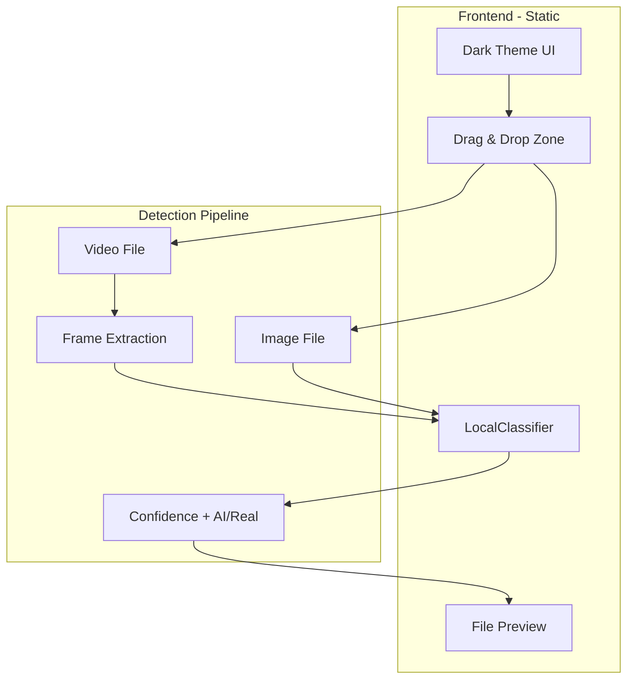

# AI Image Detector - Lightweight Detection Tool

## Architecture Overview




**Key insight:** The entire app runs **client-side**—no backend, no API costs, no server cold starts. Detection happens in the user's browser using ONNX/WebAssembly.

---

## Tech Stack (Fast, Lightweight, Free)


| Layer         | Choice                                                                 | Rationale                                                        |
| ------------- | ---------------------------------------------------------------------- | ---------------------------------------------------------------- |
| **Build**     | Vite                                                                   | Fast HMR, minimal config, ~2s builds                             |
| **Framework** | React 18                                                               | Widely used, good DX, small bundle with tree-shaking             |
| **Styling**   | Tailwind CSS                                                           | Utility-first, dark theme built-in, purges unused CSS            |
| **Detection** | [@aedilic/nonescape](https://www.npmjs.com/package/@aedilic/nonescape) | Runs in browser via ONNX, no API keys, detects 50+ AI generators |
| **Hosting**   | Cloudflare Pages                                                       | Unlimited bandwidth, global CDN, free, Git-based deploy          |


---

## Detection Parameters & Output

The Nonescape `LocalClassifier` returns:

- `**isSynthetic`** (boolean): `true` = AI-generated, `false` = real/human-created
- `**confidence`** (0–1): Probability score

**Parameters we expose to the user:**

1. **Verdict:** "AI Generated" or "Real/Human"
2. **Confidence Score:** 0–100% with visual indicator (e.g., progress bar, color-coded)
3. **Detection Basis:** Model detects artifacts from DALL-E, Midjourney, Stable Diffusion, FLUX, Adobe Firefly, and 50+ other generators
4. **Threshold:** Optional configurable threshold (default 0.5) for edge cases

**For video:** Extract frames at 1 FPS (or every 2 seconds), run detection on each, aggregate:

- Show "X of Y frames detected as AI" or "Majority: AI/Real"
- Display per-frame breakdown in a compact list

---

## Supported File Formats


| Type          | Formats                   | Handling                                                                         |
| ------------- | ------------------------- | -------------------------------------------------------------------------------- |
| **Images**    | JPEG, PNG, WebP, GIF, BMP | Direct pass to Nonescape                                                         |
| **Video**     | MP4, WebM                 | Extract frames via Canvas API (video.currentTime + drawImage), sample every 1–2s |
| **Documents** | PDF                       | Phase 2: would require backend or pdf.js + canvas render (heavier)               |


**Initial scope:** Images + video. PDF can be added later if needed.

---

## Project Structure

```
Ai_Image_Detector/
├── index.html
├── package.json
├── vite.config.ts
├── tailwind.config.js
├── postcss.config.js
├── src/
│   ├── main.tsx
│   ├── App.tsx
│   ├── index.css
│   ├── components/
│   │   ├── DropZone.tsx          # Drag & drop + file input
│   │   ├── FilePreview.tsx       # Preview + result display
│   │   ├── ConfidenceScore.tsx   # Confidence bar + verdict
│   │   └── VideoFrameResults.tsx  # Per-frame results for video
│   ├── hooks/
│   │   ├── useDetection.ts       # Nonescape wrapper, loading state
│   │   └── useVideoFrames.ts     # Extract frames from video
│   └── lib/
│       └── detection.ts          # LocalClassifier init, predict
├── public/
└── README.md
```

---

## Implementation Steps

### 1. Project Setup

- Initialize Vite + React + TypeScript: `npm create vite@latest . -- --template react-ts`
- Add Tailwind CSS: `npm install -D tailwindcss postcss autoprefixer`
- Add Nonescape: `npm install @aedilic/nonescape`
- Configure dark theme in `tailwind.config.js` (default dark mode)

### 2. Core Detection Logic

- Create `lib/detection.ts`:
  - Initialize `LocalClassifier` with `onnxruntime-web` (Nonescape uses it)
  - Use **mini model** (~80MB) for faster load; lazy-load on first upload
  - Expose `predict(file: File | Blob)` returning `{ isSynthetic, confidence }`
  - Handle loading progress for UX (show "Loading model..." with progress %)

### 3. Video Frame Extraction

- Create `hooks/useVideoFrames.ts`:
  - Use HTML5 `<video>` + `<canvas>` for compatibility
  - Seek to `currentTime` at intervals (e.g., every 2 seconds)
  - Capture frame via `canvas.drawImage(video, 0, 0)` then `canvas.toBlob()`
  - Use `video.seeked` event to ensure frame is ready before capture
  - Return array of `Blob` (image data) for each sampled frame

### 4. UI Components

- **DropZone:** Drop area + file input, accept `image/*,video/`*, validate size (e.g., max 50MB)
- **FilePreview:** Show thumbnail, filename, and detection result
- **ConfidenceScore:** Circular or linear progress, color: green (real) / red (AI), label + percentage
- **VideoFrameResults:** Show per-frame breakdown with mini thumbnails and confidence

### 5. Dark Theme & Interactivity

- Base: `bg-black` or `bg-zinc-950`, `text-zinc-100`
- Accent: `emerald-500` / `rose-500` for real/AI
- Drop zone: dashed border, hover/active states, subtle pulse animation
- Loading: skeleton or spinner with model load progress
- Results: smooth reveal, optional confetti or subtle feedback for verdict

### 6. Deployment

- **Cloudflare Pages:**
  1. Push to GitHub (repo already exists)
  2. Connect repo in Cloudflare Dashboard → Pages → Create project
  3. Build command: `npm run build`
  4. Output directory: `dist`
  5. Auto-deploy on push to `main`
- **Alternative:** Vercel or Netlify — same build command; both work with Vite out of the box.

---

## Model Loading Strategy

- **First load:** ~80MB for Nonescape mini model — show progress bar
- **Lazy load:** Only load when user first uploads a file (or on first interaction)
- **Caching:** Browser caches model; subsequent visits load faster

---

## Edge Cases & Limitations

- **Large videos:** Limit to first 60 seconds or 30 frames to avoid long processing
- **Unsupported formats:** Show clear error message with supported list
- **Low confidence (0.4–0.6):** Display "Uncertain" and suggest manual review
- **Mobile:** Nonescape may be slower on low-end devices; consider showing a "Processing..." state

---

## Files to Create/Modify


| File                   | Action                                                           |
| ---------------------- | ---------------------------------------------------------------- |
| `package.json`         | Create with Vite, React, Tailwind, Nonescape                     |
| `vite.config.ts`       | Create with base path                                            |
| `tailwind.config.js`   | Create with dark theme                                           |
| `index.html`           | Create entry point                                               |
| `src/main.tsx`         | Create React entry                                               |
| `src/App.tsx`          | Create main layout + DropZone + results                          |
| `src/components/`*     | Create DropZone, FilePreview, ConfidenceScore, VideoFrameResults |
| `src/hooks/`*          | Create useDetection, useVideoFrames                              |
| `src/lib/detection.ts` | Create Nonescape wrapper                                         |
| `README.md`            | Update with setup, usage, deploy instructions                    |


---

## Summary

- **Zero backend** — everything runs in the browser
- **Zero API cost** — Nonescape is open-source, runs locally
- **Free hosting** — Cloudflare Pages
- **Fast** — Vite build, minimal JS, CDN delivery
- **Dark & interactive** — Tailwind dark theme, drag-and-drop, confidence visualization
- **Extensible** — Easy to add PDF or more formats later

