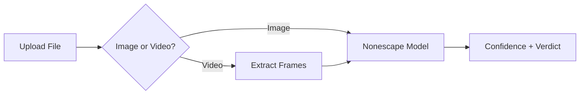

# AI Image Detector

A lightweight, client-side tool that detects whether images or videos are **AI-generated** or **real/human-created**. Runs entirely in your browser — no uploads, no API keys, no backend.


## Features

- **Drag & drop** or click to upload
- **Images:** JPEG, PNG, WebP, GIF, BMP
- **Videos:** MP4, WebM (frame-by-frame analysis)
- **Confidence score** (0–100%) with color-coded verdict
- **Dark theme** with smooth animations
- **100% client-side** — files never leave your device
- **Free** — no API costs, open-source detection model

## How It Works



1. **Images** are sent directly to the Nonescape ONNX model in your browser.
2. **Videos** are sampled every 2 seconds (up to 30 frames, 60 seconds max). Each frame is analyzed, and results are aggregated.
3. The model detects artifacts from **DALL-E, Midjourney, Stable Diffusion, FLUX, Adobe Firefly**, and 50+ other AI generators.

### Architecture Deep Dive

| Component | Role |
|-----------|------|
| **DropZone** | Handles drag-and-drop and file input. Validates type (image/video) and size (max 50MB). |
| **useDetection** | Orchestrates the flow: loads Nonescape model on first use, runs `predict()` for images or `extractVideoFrames()` + `predictBatch()` for videos. |
| **detection.ts** | Wraps `@aedilic/nonescape` LocalClassifier. Lazy-loads the mini ONNX model (~80MB) from CDN. Caches the classifier instance. |
| **videoFrames.ts** | Uses HTML5 `<video>` + `<canvas>` to extract JPEG frames at 2s intervals. No FFmpeg or server needed. |
| **ConfidenceScore** | Renders verdict (AI/Real/Uncertain) and a 0–100% bar. Green = real, red = AI, amber = uncertain (40–60%). |

## Quick Start

### Prerequisites

- Node.js 18+
- npm or pnpm

### Install & Run

```bash
# Install dependencies
npm install

# Start dev server
npm run dev
```

Open [http://localhost:5173](http://localhost:5173).

### Build for Production

```bash
npm run build
```

Output is in `dist/`. Serve with any static host.

## Deployment (Free Hosting)

### Cloudflare Pages (Recommended)

1. Push this repo to GitHub.
2. Go to [Cloudflare Dashboard](https://dash.cloudflare.com) → **Workers & Pages** → **Create** → **Pages** → **Connect to Git**.
3. Select your repo.
4. Build settings:
   - **Build command:** `npm run build`
   - **Build output directory:** `dist`
   - **Root directory:** `/` (or leave default)
5. Deploy. Your site will be live at `*.pages.dev`.

### Vercel

```bash
npm i -g vercel
vercel
```

Or connect your GitHub repo in the [Vercel Dashboard](https://vercel.com).

### Netlify

1. Connect repo at [Netlify](https://app.netlify.com).
2. Build command: `npm run build`
3. Publish directory: `dist`

## Project Structure

```
src/
├── components/       # UI components
│   ├── DropZone.tsx
│   ├── FilePreview.tsx
│   ├── ConfidenceScore.tsx
│   └── VideoFrameResults.tsx
├── hooks/
│   └── useDetection.ts
├── lib/
│   ├── detection.ts   # Nonescape wrapper
│   └── videoFrames.ts # Video frame extraction
├── App.tsx
├── main.tsx
└── index.css
```

## Tech Stack

| Layer    | Technology                          |
|----------|-------------------------------------|
| Build    | Vite 5                              |
| Framework| React 18                            |
| Styling  | Tailwind CSS                        |
| Detection| [@aedilic/nonescape](https://www.npmjs.com/package/@aedilic/nonescape) (ONNX, mini model) |

## Limitations

- **First load:** ~80MB model download (cached by browser).
- **Videos:** Limited to first 60 seconds, 1 frame per 2 seconds.
- **Uncertain results (40–60%):** Manual review recommended.
- **Mobile:** May be slower on low-end devices.

## License

MIT
